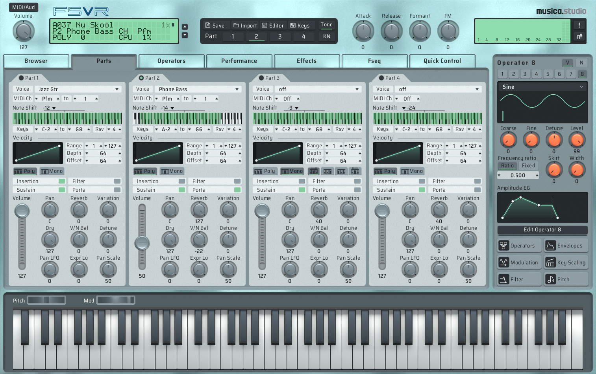

# FSVR



**FSVR**, Formant Synthesizer Virtual Rack, is a software reconstruction of the Yamaha FS1R as a plugin and a console synth: its firmware logic rewritten in C++ from the decompiled ROM, four parts, 32 channels, the filter, both LFOs, pan, the three effect blocks, performances and Fseq playback. CLAP, VST3, VST2 and standalone on Windows, macOS and Linux, an AU on macOS and a 32-bit VST2 with a DXi on Windows, with an editor for every parameter the unit has, a bank manager for your own .syx libraries, a morph square and Import Audio for Fseqs.

Download the latest build: **https://github.com/musicastudio/FSVR/releases/latest** (no installer, no dependencies).

Licensed GPL-3, see `LICENSE` and `NOTICE.md`.

**Discord:** https://discord.gg/6sXu3GmkNm

The tone generator, the filter, the CPU-side firmware logic and everything that feeds them now match rgwan's FS1R inside the measurement, file by file. The one thing left is the effects layer, VOP3-2: its 87 algorithms are still modelled from the Data List rather than measured. See [FS1R vs FSVR](#fs1r-vs-fsvr).

## Demos

### FS1R DEMO SONG 2: Full Tines

**FS1R Hardware Recording**

https://github.com/user-attachments/assets/fc235492-d053-4abb-af04-8e1041c32d46

**FSVR (v0.4.2)**

https://github.com/user-attachments/assets/cd14ac04-0fbb-4622-a766-381059fc2659

### FS1R DEMO SONG 1: Vokodrone

**FS1R Hardware Recording**

https://github.com/user-attachments/assets/8afa466b-e7c4-4427-a058-392120f1a15d

**FSVR (v0.4.2)**

https://github.com/user-attachments/assets/8e32c342-dfe5-4d7e-b1a8-d9215826331c

## Background and History

In 2025 Zhiyuan Wan ([rgwan](https://github.com/rgwan/)) created the **[rgwan/fs1r_firmware_RE](https://github.com/rgwan/fs1r_firmware_RE)** repository to study the hardware and software on the Yamaha FS1R synthesizer. That project extracted the SH7044's 256 KB internal flash through a hooked UART, dumped the 2 MB external EPROM, dumped the PLG150-DX ROM, captured the board's UART traffic, and published a Ghidra project with the boot, loader, flash and LCD code already named. 

The progress of this work was shared on the [yamahamusicians.com forum](https://yamahamusicians.com/forum/threads/im-trying-to-emulating-an-fs1r.23211/).

Just over a year later in September 2026, James Hansen ([jameshansen](https://github.com/jameshansen/)) created this repository, after analyzing and attempting to create the FS1R in software based on the material in rgwan's repository using a custom approach where the firmware files were decompiled with [Ghidra](https://github.com/NationalSecurityAgency/ghidra) into a database that can be read and explored by a coding AI agent.

Today, jameshansen and rgwan are collaborating on this project to improve the accuracy of the engine and bring it as close to the FS1R as possible.

AI coding agents and frontier LLMs have played a large role in making this project possible. The initial recreation was created using Claude Fable 5.1, with much of the ongoing analysis and engine improvements being assisted with Claude Opus 5. As part of the collaborative process, developers on the project can now use these tools via [Discord](https://discord.gg/6sXu3GmkNm).

## VOP3 Progress and Research (as of Oct 1 2026)
The current largest missing feature is true recreation of the effects and filters. We have approximations but we are working on improving the accuracy. This is the key difference in sound between the real unit and FSVR.
* A patched firmware has been created to poke memory on a real FS1R to read registers and values.
* The AN1x and PL150-AN run the AN engine on a VOP3. The EX5 keyboard runs the exact same AN engine on a MB91103PF (Fujitsu FR20), which is understood and documented. This is our "rosetta stone" helping us to understand the VOP3 code.
* The AI Coding Agent now has realtime access to an FS1R running the patched firmware, able to continuously work to understand the VOP3.

## FS1R vs FSVR

**Where it stands, 2026-09-24: everything but the effects is done.** Against rgwan's unit the synthesis engine matches close to 1:1. Every constant that models the two custom chips is measured off a recording or a register session rather than guessed, and every file in the 38-file capture set outside the three effect files sits inside the measurement: the amplitude EG, the formant window and its skirt on all seven forms, the noise formant, FM and feedback, detune, the velocity law, the per-voice filter and its EG, LFO1 and LFO2, pan and the output stage. The one remaining gap is **VOP3-2, the effects DSP**: reverb, variation, insertion and the master EQ are modelled from the Data List and read 17 to 29 dB against real impulse responses. Until that chip's program is decoded or its blocks measured against a register session, a performance with its effects on will differ from the unit in its reverb and effect tails and nothing else. `docs/fidelity_plan.md` has the numbers per file.

The FS1R (1998) is Yamaha's formant-shaping FM synth: 8 operators per voice, 32 channels, four parts, and a second oscillator type that generates a formant with a shaped spectral window instead of a sine. Its tone generator is the YMP706, a QFP128 part used in exactly two products, the FS1R and the PLG150-DX board. There is no public register documentation for it and no emulation of it anywhere.

FSVR is a rewrite of that logic, not an emulation of the processors on the board. The SH7044 is not emulated and its firmware does not run here. `tools/build_fs1r_ghidra.py` imports the EPROM into Ghidra as SH-2 and decompiles it, and the note-on path, the tick pipeline, the parameter conversion tables and the 88-algorithm routing table are read straight out of that code and ported to C++. The two custom chips cannot be treated that way, since nobody has register semantics for the YMP706 or an instruction set for the YSS236, so they are models, and every constant behind them sits in `src/fs1r/chips/cal.h` where calibrating against a recording of a real unit is one table edit.

Three words carry the status of each piece below. **Read** is lifted out of the decompiled firmware, its tables or the board, and needs no calibration. **Measured** is a model whose constants came off a recording of rgwan's unit rather than off a guess. **Modelled** is inferred from the DX7 lineage, Yamaha's formant synthesis patent (US5610354) or the Data List, and marked INFERRED in the source.

The practical result is that patches, performances and Fseqs load and play with the same parameter interpretation the hardware uses, because the same logic computes them. What still differs from a real unit lives inside the two custom chips.

A short list of places FSVR behaves differently **on purpose** is kept in [docs/Differences.md](docs/Differences.md), with the firmware address behind each one where there is one. The engine has one entry: a part's filter switch is live here, so turning the filter on or off reaches the notes already sounding, where the unit latches that switch per note at note-on and only its cutoff and resonance follow a held note. The rest are the plug-in's additions, things the unit never had: the morph square, user libraries without the unit's memory limits, and Import Audio.

### The processors

- **SH7044 CPU**, SH-2 at 28 MHz with 256 KB of internal flash. **Read, and verified against the unit.** The firmware's logic is rewritten in C++: the note-on path, the 192.3 Hz MTU2 tick, the CMT1 Fseq frame timer and every conversion table. rgwan ran a debug monitor over the whole capture set on 2026-09-18 and read the voice image back segment by segment, so the CPU side is checked byte for byte, 240,476 checks over 802 segments with no mismatch. Running the real firmware on an emulated SH-2 core (gearmulator has one with the SH7040 peripherals) stays on the list as a second opinion, not as a replacement.

- **YMP706-F tone generators**, two of them, 16 channels each on an 8-bit write-only bus. **CPU side read, chip side modelled and largely measured.** There is no register documentation and no die shot, and the chip is too rare for one, so it stays a model. Everything the CPU computes for it is read from the firmware: all 88 algorithms, the DX7 VCED and ACED conversion, frequency words, EG rate and level conversion, velocity curves and attenuation, level key scaling, EG bias, note shifts, part detune, master tune, bend, the software pitch EG, LFO1 and LFO2, portamento, the mono modes with priorities and legato, note and velocity limits, part volume, expression and balance, and pan. What the chip does with those values breaks down as follows.
  - **The amplitude EG.** Measured. The rate law holds to 0.6 % over 38 measured rates and the level register is 0.376287 dB a step, a halving every sixteen. The attack's shape, its floor, the hold's length and the key rate scaling were all DX7 guesses and all wrong until two envelope recordings settled them; shape error over a hundred segments went from 5.45 dB rms to 0.58. The key code law is a table measured at every one of its 37 key codes, and the hold does not scale with it. [docs/aeg.md](docs/aeg.md).
  - **FM, feedback and the modulation index.** Measured. 3.369 cycles at full level, off two sideband sweeps and confirmed by `03_fm`'s own spectra; feedback is `0.5 * 2^(fb - 7)`.
  - **Detune.** Read, and it needs no constant at all. It is not a fixed step but the EPROM's own key scaled `FRMDET` table, matched over six octaves to half a cent, which took a vibrato off demo song 2 that the unit does not have. [docs/detune.md](docs/detune.md).
  - **The voiced formant window.** Measured. The window is a time set by the bandwidth byte, the skirt doubles a `sin^p` exponent per step, and there are two window shapes: symmetric on `all2`, `odd2` and `res2`, a `sin^p` rise on a `sin^2` fall on `all1`, `odd1`, `res1` and the formant. `all1` and `all2` are that window alone, read by phase. All six harmonic forms land inside 0.5 to 1.8 dB of the unit's line amplitudes at every skirt, and the formant's skirt sweep at 0.44 dB of band shape. [docs/skirt.md](docs/skirt.md), [docs/formant.md](docs/formant.md).
  - **The noise formant**, the unvoiced operator. Measured, 2026-09-21 and 2026-09-22. Two digital one-poles with different coefficients on white noise, both read off the register and the skirt at three centres, a two-sample mean on the output, a level table and a threshold resonance. Level error over the four unvoiced files is 0.2 to 1.05 dB and the octave bands agree inside 0.5 dB to 16 kHz. The resonance carrier's amplitude and the noise it cuts are read against the register at four settings (2026-09-24). [docs/noise.md](docs/noise.md).
  - **Amplitude modulation sensitivity.** Measured: the chip's AM word is seven bits and the sensitivity is a 3-bit shift-and-add, {0,1,2,4,5,6,7,8}/8.
  - **Which write starts a note.** Unknown. 0xFC/0xFD goes out before the registers load and nothing says what the chip makes of it.

- **YSS236-F / VOP3-1, the per-voice filter**, at 0x800200. **CPU side read, response measured.** Yamaha's VOP3 is the same programmable DSP that is the synthesis engine of the AN1x, AN200 and PLG150-AN; the FS1R has two, and this one sits in a channel-level loop off both tone generators. The CPU's whole side of it is read out of the firmware: sixteen filter channels mapped to parts, a dirty flag per parameter group, and closed-form conversions for cutoff, resonance, type and input gain. The response is measured off `15_filter`: the corner is `17.4 * 2^(byte / 12)` to 0.098 octaves rms, the three lowpasses are taps off one 4-pole ladder whose feedback goes as the cube of resonance table A, and HPF, BPF and BEF a 2-pole state-variable filter, 24, 18, 12 and 12 dB per octave to a decibel. The filter EG is stepped segment by segment by the CPU and run by the chip; its rate law came off the CPU's own stage word over the debug monitor and its depth scale off one recording. `tools/extract_vop3.py` has the microcode out into `docs/vop3/`, register by register, but the instruction set is undecoded.

- **YSS236-F / VOP3-2, the effects**, at 0x800000. **Parameter encoding read, algorithms modelled. The one remaining gap in the engine.** Reverb (17 types), variation (29), insertion (41) and the master EQ in the XG topology, with the part dry and send levels and the insertion switch, in `src/fs1r/chips/vop3_effects.h`. The parameter *encoding* is read rather than guessed, recovered out of the 360 preset performances and matching every documented default. The 87 algorithms themselves are modelled from the Data List, and were measured against real impulse responses for the first time on 2026-09-21, at 16.9, 27.2 and 28.8 dB over eighty-four segments, in a set where most files agree with the unit inside half a decibel. `tools/extract_vop3_2.py` has that chip's two images out into `docs/vop3_2/`. Decoding the VOP3 instruction set is the only route to bit-exact effects and a bit-exact filter; it is open research on the scale of a full DSP core, and the modelled effects ship regardless.

- **The board around them.** Read. One 24.576 MHz crystal runs the audio side and the main Sanyo LC78834M DAC is the I2S master at exactly 48 kHz, so the engine runs at 48 kHz whatever the host rate and resamples on the way out. The recording tap is that DAC's I2S input, after both DSPs and before the analogue volume pot, which is what makes a recording's absolute level comparable. The output path's fixed gain, the hard clip on the channel accumulator and the filter loop's insertion loss are all numbers off that tap. `docs/research.md` 2.0.1 and section 8 have the clocking and the CS2 decode.

### The data and the control paths

All read from the firmware and its tables, and all finished.

- **Factory data.** The 1408 preset voices, 384 performances and 90 formant sequences out of the EPROM, plus the voice (608 bytes), performance (400), Fseq and system bulk layouts and the DX7 VCED and ACED maps. Extracted into `presets/` and built into the plugin, so the patch browser needs no EPROM image. The unit's `Internal Perform Bank` and `Internal Voice Bank` are copies its factory set routines make from the presets into NVRAM, so FSVR has no fixed internal banks; the plug-in keeps a user library of .syx files instead, as many performances, voices and Fseqs as you import or store.
- **Fseq playback.** Frame timing on its own timer, every loop mode with the direction the loop points imply, the start offset, the performance start delay, scratch mode from controller destination 47, MIDI clock sync at all five speed ratios, and the voice Fseq switches.
- **Controller sets.** The whole matrix out of three firmware functions: the source bit order, the bipolar and raw source conversions, the clamped sum, the three scalers and which of the 48 destinations uses each, the per-part gate, and the destinations that edit a part byte instead of contributing an offset. The voice's own Formant and FM control matrix with it.
- **MIDI and sysex.** The whole parameter map in both directions, bulk dumps and parameter changes in and out, dump and parameter requests answered with checksummed replies, RPN 0-2, the ten NRPN 01 xx part parameters, bank select and program change in both performance and multi modes, MIDI clock and active sensing.

### Where it stands

Against rgwan's digital recording of the built-in demo, which the unit plays from its own EPROM so the same byte stream drives both, with the effects in the path on both sides: median envelope correlation 0.976, worst 0.912, mean band error 5.0 dB and tilt 2.0 dB. Against the 38 frozen capture files, twenty-seven agree with the unit inside half a decibel of level; the velocity law, the EG decay to a level, the modulator chain and the second and third links of it are inside a tenth, and the eleven that do not are the three effect files, two whose number is a scoring artifact below 100 Hz, two at frame and LFO rates the analyzer cannot align, two at 1.2 and 1.7 dB, and the two session-4 files whose level column measures a decay window and an 8 kHz noise offset rather than a level.

Nothing in `cal.h` is a guess any more, and nothing outside the effects is open. The last three modelling items closed on 2026-09-24 off data already recorded: the window family behind the "1" forms and the formant, the `all1`/`all2` construction, and the key code table at the demo drum's note; the fourth hardware session the same day then read that table at every semitone, found the EG hold does not scale with it, and read the unvoiced resonance carrier against the bandwidth register. [docs/fidelity_plan.md](docs/fidelity_plan.md) has the per-file table; [STATUS.md](STATUS.md) carries the KNOWN / INFERRED / UNKNOWN lists and the open work; `FS1R.unlock/captures/fs1r_capture_session4.py` holds the one register dump still to run, the per-channel arrays, which the engine is not waiting on.

**Known issue:** performances that layer two parts of a voice with all eight unvoiced operators live (A020 Vox Morph is the extreme) are heavy, about half a desktop core at 8 notes and more than a laptop i7 has to give. [docs/performance.md](docs/performance.md) has the measurements and the fixes in order of cost.

What is left is **the effects layer, VOP3-2**: 87 algorithms modelled from the Data List, 17 to 29 dB against real impulse responses over eighty-four segments. It is a rebuild of each block from the microcode or a measurement of each against a register session, and it is the last piece. Tiers 0 to 3 and 5 are done, so the engine, the library and console split, the plugin in every format with its editor, the licence and CI are all in, and Tier 4, fidelity and verification, is complete outside the effects.

## Build and run

### Prebuilt

[The latest release](https://github.com/musicastudio/FSVR/releases/latest), also on [musica.studio](https://musica.studio/code/fsvr), has an installer for Windows, macOS and Linux that puts every format in place, and each format as its own zip, `FSVR-<OS>-<format>.zip`: CLAP, VST3, VST2 and standalone everywhere, an AU for Logic Pro on macOS, and on Windows `FSVR-Windows-VST2-32-DXi.zip`, a 32-bit VST2 carrying a DXi (Cakewalk's older plug-in format, registered with `regsvr32`). The macOS builds are universal, Apple silicon and Intel in one binary. No dependencies. [docs/plugin_guide.md](docs/plugin_guide.md) is the user guide.

Every push to `main` builds the same set through [GitHub Actions](https://github.com/musicastudio/FSVR/actions), so a build for an OS you do not own is always one Actions run away, including on a fork. `.github/workflows/build.yml` is four jobs:

- **engine**, on `windows-latest`, `ubuntu-latest` and `macos-latest`. Plain CMake with no downloads, then `ctest`, which runs the effect and engine self checks everywhere. Uploads `FSVR-console-windows`.
- **plugin**, on Windows x64, Windows x86, Linux and macOS. Installs the X11, ALSA, JACK and PulseAudio headers on Linux, configures with `-DFSVR_BUILD_PLUGIN=ON`, runs the plug-in's own checks (`check_plugin`, `check_gui`) on the 64-bit legs, and uploads `FSVR-plugin-windows`, `FSVR-plugin-windows-x86`, `FSVR-plugin-linux` and `FSVR-plugin-macos`, each holding every format for that platform.
- **installer**, on Linux. Checks out [musicastudio/Installer](https://github.com/musicastudio/Installer), packs the plug-in artifacts into it and builds `FSVR-Windows-Installer.exe`, `FSVR-MacOS-Installer.zip`, `FSVR-Linux-Installer` and `FSVR-MacOS-Update` (the bare binary the macOS updater runs), at the version in `CMakeLists.txt`.
- **release**, on a `v*` tag only. Splits the plug-in artifacts into one zip per format, named as FM8.plus names its own (`FSVR-Windows-VST2-64.zip`, `FSVR-Windows-VST2-32-DXi.zip`, `FSVR-MacOS-AU.zip` and so on), adds the installers, the console and `SHA256SUMS.txt`, and attaches them to a GitHub release. The installers' updater never reads GitHub: musica.studio mirrors each release and serves the update from there.

### Building it

CMake 3.24 or later everywhere, C++17. The engine, the console and the self checks need no dependencies:

```bash
cmake -B build/cmake -S .                 # fs1rLib, test_effects, bin/render_capture, and bin/fsvr_console on Windows
cmake --build build/cmake --config Release
ctest --test-dir build/cmake -C Release   # the self checks
```

The plug-in adds one flag. Its first configure downloads the CLAP SDK and [clap-wrapper](https://github.com/free-audio/clap-wrapper), which fetches the VST3 and AU SDKs, RtAudio and RtMidi, and Import Audio's decoders ([dr_libs](https://github.com/mackron/dr_libs) and [stb_vorbis](https://github.com/nothings/stb)), so it needs the network once:

```bash
cmake -B build/plugin -S . -DFSVR_BUILD_PLUGIN=ON
cmake --build build/plugin --config Release
ctest --test-dir build/plugin -C Release -R plugin   # the plug-in's own check
```

On Linux install `libx11-dev libasound2-dev libjack-jackd2-dev libpulse-dev pkg-config` first (Debian and Ubuntu names). On Windows a second build with `-A Win32` makes the 32-bit VST2 with the DXi in it.

Every format lands in a folder of its own under `bin/`: `bin/CLAP`, `bin/VST3`, `bin/VST2` and `bin/Standalone`, `bin/AU` on macOS, which is the only plugin format Logic Pro loads, and `bin/VST2 32-bit and DXi` from the 32-bit build. The 1408 factory voices, the 384 factory performances and the 90 preset formant sequences are built into the plugin, so its browser needs no EPROM image.

On Windows `build.bat` is the shortcut, MSVC x64 out of the VS 2022 Professional vcvars64:

```bat
build.bat            bin\fsvr_console.exe, the console
build.bat test       build and run the self checks
build.bat plugin     every plug-in format, 64-bit and 32-bit, then check_plugin and check_gui
```

Everything meant to be run lands in `bin/`; objects and the test binaries go to `build/`.

### The console

`bin/fsvr_console` is the test harness on top of the engine library. It is Windows only, since it uses WinMM for MIDI and waveOut for audio, but its offline render path needs no devices at all.

```bat
fsvr_console -l                                     list MIDI ports
fsvr_console                                        asks for a MIDI input once, remembers it in bin\fsvr_console.ini
fsvr_console -m 0 -o 0 -v presets\native\000_Ballad_EP.syx
fsvr_console -v presets\dx7\004_Pianotone1.syx      DX7-format presets, converted the way the firmware does
fsvr_console -r <eprom.bin> -p 128                  ROM voice, 0-255 native and 256-1407 the DX7 banks
fsvr_console -r <eprom.bin> -P 0                    ROM performance 0-383 with its voices and Fseq
fsvr_console -r <eprom.bin> -P 0 -f 29              override the Fseq with preset Fseq 1-90
fsvr_console -v presets\native\128_BagPipe.syx -w test.wav -n 60 -d 3     offline render, no devices needed
```

Options. `-m` MIDI input, `-o` MIDI output for dump and parameter replies, `-c` force all parts onto one MIDI channel (the default is each part on its own receive channel), `-v` a sysex file holding FS1R voice, performance or Fseq bulk dumps or a DX7 VCED dump, with `-p` picking the n-th dump in the file, `-r` a 2 MB EPROM image with `-p` voice, `-P` performance and `-f` Fseq, `-g` output gain, `-w` offline render with `-n` note, `-n2` a second note a third of the way in, `-cc num=val` control changes sent before the note, `-d` seconds, `-mono` part 1 mono with full-time portamento, `-selftest` the engine self check. `FS1R_DEBUG=1` prints the computed register values at every note on.

MIDI. Notes, bend, both aftertouches, the control numbers the system table assigns to KN1-4, MC1-4, FC, BC, Formant and FM, CC5/65 portamento, CC7 volume, CC10 pan, CC11 expression, CC64 sustain, CC91/94 sends, CC120/121/123/126/127, RPN 0-2, the ten NRPN 01 xx part parameters, bank select and program change in both performance and multi modes, MIDI clock, active sensing, FS1R bulk dumps and parameter changes across the whole map, and dump and parameter requests answered. The performance's controller sets route the sources to the destinations.

The EPROM image the `-r` examples take is rgwan's dump with its 16-bit words byte-swapped into CPU order, kept outside this repo in `../FS1R_DISASM/roms/`. FSVR does not ship it, and nothing but the `-r` paths needs it.

### Checking a change

```bash
python tools/check_wav.py test.wav 60   # pitch, harmonics and envelope of one render
python tools/regress.py                 # the whole fixed preset list against the stored reference
```

## Repo Layout

**Engine.** No Windows, no host, no GUI. This is what the plugin links. The tree says where a claim comes from, which is the thing to know before changing anything in it.

- `src/fs1r.h` the public header, `fs1r::Device`. The only one the plugin includes
- `src/fs1r/hardware.h` the FS1R's own numbers, read off the board. Facts, never tuned
- `src/fs1r/internal.h` the engine's shared declarations, including `struct Synth`

`src/fs1r/firmware/` is **KNOWN**, rewritten from the disassembly, and every claim in it cites a `FUN_` address. A disagreement with a real unit is a bug here, not a calibration.

- `patch.cpp` voice, performance and part data as the firmware decodes it, with the DX7 conversion
- `controllers.cpp` the eight controller sets, the three scalers and the 48 destinations
- `notes.cpp` note on and off, operator setup, pitch, portamento, and the 192.3 Hz tick
- `fseq.cpp` formant sequence playback; `midi.cpp` MIDI in and sysex in and out; `rom.cpp` EPROM and sysex loading
- `tables.h` the EPROM's conversion tables, by `tools/extract_tables.py`; `algorithms.h` the 88-algorithm routing table

`src/fs1r/chips/` is **INFERRED**, because neither custom chip has public register documentation. These are claims about the hardware, changed by measuring against a recording and never by taste.

- `cal.h` the calibration surface, every modelled constant in one place
- `ymp706.cpp` the tone generator: operators, envelopes, the formant window, and the render path
- `vop3_filter.h` VOP3-1's filter; `vop3_effects.h` VOP3-2's reverb, variation, insertion and master EQ

`src/fsvr/` is **ours**. Nothing in the hardware corresponds to any of it.

- `tuning.h` cost knobs, the control-rate decimation and the queue cap. Changing one must not change the output
- `fastmath.h`, `fastmath.cpp` the sample loop's sine, 2^x, dB and tanh: a table (the default), CORDIC, a hybrid of the two, or raw libm, chosen by `FSVR_MATH`
- `device.cpp` `fs1r::Device`, host-rate resampling and state as bulk dumps
- `smf.h` Standard MIDI File reading; `selftest.cpp` the engine self check
- `display.h` how the unit shows values, for editors and displays: fixed operator frequencies, ratios and every effect parameter value, with each effect type's parameter slots. Transcribed from K_Take's [FS1R Editor](https://synth-voice.sakura.ne.jp/fs1r_editor_english.html) (freeware) and checked against the Data List and the ROM
- `src/console/main.cpp` the test console: WinMM MIDI in and out, waveOut, offline render

**Plugin.** The plug-in layer, which never models synthesis; it moves parameter values in and out of the engine as sysex, exactly as a hardware editor would.

- `plugin/plugin.cpp` the processor: every param a sysex parameter change into `fs1r::Device`, the engine's own bulk dumps read back into the params, program change, the morph square, the monitor, and the Save and Import menus' and bank manager's requests
- `plugin/library.cpp` the bank manager's data: .syx files as banks (FS1R bulks, DX7 single voices and 32-voice banks), the factory bank and the user library folder; `audio_decode.cpp` and `audio_fseq.cpp` Import Audio
- `plugin/skin/` the editor, a [Hollow](hollow/) skin: views, params (`params.json`, 3,223 of them), images (at 1x in `images/`, at 0.5x, 0.75x, 1.5x and 2x in `scales/`) and its TrueType fonts, and `data/fs1r_sysex.json`, the address and packing of every param. This copy is the source: edit it with the web editor of the Hollow project (kept beside this repository, not published), which opens it by default and saves into it
- `blender/` the skin's artwork as Blender components (the window's chrome, buttons, panels, displays, glyphs, logos, pots, faders, wheels and keys), `blender/scripts/` what builds and renders them into the skin at every scale, and `blender/textures/` the blue mottled chrome they share ([docs/editor.md](docs/editor.md), The art: Blender)
- `plugin/generated/` the bundled factory banks `fs1r_presets.syx` with its index `fs1r_presets.csv`, `fs1r_performances.syx` and `fs1r_fseqs.syx`, packed from `presets/` by `tools/make_presets_blob.py`, and `parameterDescriptions_fs1r.json`, the 893 parameters with their sysex addresses and bit layouts, by `tools/gen_parameters.py`, which the skin's param table is built from
- `hollow/` the plug-in framework: the formats (CLAP, and through clap-wrapper VST3, AU and the standalone; VST2 and the DXi of its own), the skin runtime and software renderer, and the editor window on Windows, macOS and X11. [hollow/docs/skin-format.md](hollow/docs/skin-format.md) is the skin's contract

**Tools, firmware.**

- `tools/build_fs1r_ghidra.py` imports and decompiles the firmware into `../FS1R_DISASM` with pyghidra (SH-2); `decomp.py`, `ghidra_disasm.py`, `ghidra_switches.py`, `ghidra_handlers.py` and `ghidra_probe.py` query it
- `tools/ghidra_ctrl_dests.py` decompiles the 48 controller destination handlers, which Ghidra never turns into functions because only a pointer table reaches them
- `tools/extract_tables.py`, `extract_presets.py` and `extract_demo.py` pull the conversion tables, the 1408 voices, 384 performances and 90 Fseqs, and the demo songs out of the EPROM image
- `tools/extract_vop3.py` and `extract_vop3_2.py` pull the two VOP3 microcode uploads into `docs/vop3/` and `docs/vop3_2/`

**Tools, calibration.**

- `tools/make_capture_set.py` writes `captures/requests/`, the hardware capture kit: Standard MIDI Files that play a measurement into a real FS1R, each setting up its own patches by sysex and opening and closing with a marker so a recording aligns itself. Built out of `tools/fs1r_patch.py`; the other `make_capture_*.py` are the later additions to the set
- `tools/analyze_capture.py` aligns a recording to the manifest, measures every segment, fits the constants it can, and diffs the result against our own render of the same file. `bin/render_capture` makes that render, which is also how a request file is checked before anyone is asked to play it. `tools/bench_captures.py` rebuilds the renderer from the source as it stands and prints one line per file; `tools/render_demo.sh` does the same for the demo set and appends to the ledger
- `tools/render_song.py`, `check_demo.py` and `demo_probe.py` play the extracted demo songs through the engine and score them against rgwan's recording; `demo_scores.txt` is the running ledger
- `tools/pitch_track.py`, `split_capture.py` and `analyze_unvoiced2.py` the per-measurement readers

**Tools, checks.**

- `tools/regress.py` renders the fixed preset list and diffs it against `regress_ref.json`: pitch, harmonic peaks, envelope, stereo width, centroid
- `tools/test_effects.cpp` decodes and sweeps every effect type, and `fsvr_console -selftest` (`engine_selftest` away from Windows) is the engine check. Both run under `ctest`
- `tools/check_plugin.cpp` drives the plug-in's processor the way a host does: factory banks, a saved session, Import SysEx, the bank browser, morph, Import Audio, program change, panic, the monitor, Save to Bank, .fsvr presets and the right-click menus. `ctest` runs it in a plug-in build
- `tools/check_gui.cpp` drives the editor over the processor without a window, as a mouse and a keyboard would: the top bar's menus and toggles, every page by its tab or button, the operator panel and its waveform, the browser's right-click menus, every dialog, the modal's veil, Escape and close X, the close prompt, the scale menu at every scale and About, then every page's dials, faders, dropdowns and toggles. `ctest` runs it as "gui"
- `tools/check_wav.py`, `check_formant.py` and `check_presets.py`, the rest of what `build.bat test` runs; `check_skirt.py` renders every harmonic form at every skirt against the register sweep

**Data.**

- `presets/` the factory voices, performances and Fseqs as `.syx` with `index.csv`, plus the DX7 bank
- `captures/requests/` the capture kit as MIDI with a README listing what each file settles, `captures/hardware/` the recordings that came back, `captures/analysis/` the per-segment numbers, `captures/engine/` our own renders of the same files

**Docs.**

- [docs/research.md](docs/research.md) what is known about the hardware, and [docs/ymp706_registers.md](docs/ymp706_registers.md) the tone generator interface and the CPU-side engine lifted from the firmware. These two are the reference.
- [docs/fidelity_plan.md](docs/fidelity_plan.md) the ranked read of where the engine stands against every recording; `capture_0918.md` and `hardware_capture_request.md` are the capture working
- `docs/aeg.md`, `formant.md`, `skirt.md`, `noise.md` and `detune.md`, one measurement each, the working behind the constants in `cal`
- `docs/midi_dispatch.md` how a Note On, a Control Change and both aftertouches get from the SCI0 interrupt to the tone generator; `interface_from_firmware.md` the unit's screen tables, cursor stops and MIDI View, read out of the EPROM
- `docs/vop3_microcode.md`, `vop3_2_microcode.md` and `vop3_pinout.md` the VOP3 reference
- [docs/Differences.md](docs/Differences.md) the short list of places FSVR knowingly behaves differently from the unit, and why
- [docs/plugin_guide.md](docs/plugin_guide.md) the plugin user guide, and [docs/editor.md](docs/editor.md) why the editor is the way it is: which of the unit's limits it drops, the morph square, the bank manager and what the processor answers for the GUI. The Data List and owner's manual text and the formant patent are here too.
- [hollow/docs/](hollow/docs/) the plug-in framework: `framework.md` how a product is built on it, `skin-format.md` the skin's contract
- [STATUS.md](STATUS.md) what is known, what is modelled and what nobody knows, with the open work at the end
- [docs/findings.md](docs/findings.md) the research log, newest first, and the evidence behind each constant
